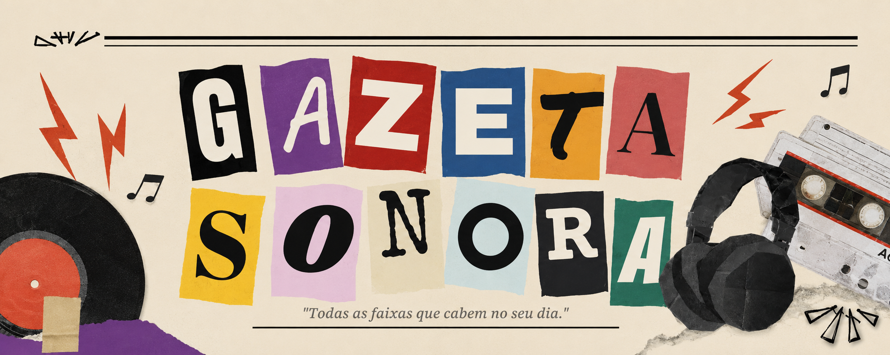

  

<h1 align="center">🎵 Gazeta Sonora</h1>

<strong>Todas as faixas que cabem no seu dia.</strong>

---

## 📖 Sobre o projeto

O **Gazeta Sonora** é um site que transforma a descoberta de músicas em uma experiência divertida e interativa. Inspirado na estética de jornais antigos e colagens retrô, o projeto convida o usuário a sair da rotina e descobrir novas faixas de forma totalmente aleatória.

A proposta é simples: em vez de escolher uma música, o usuário deixa que o acaso decida a trilha sonora do seu momento.

## 🎧 Como funciona

Ao acessar a página, basta clicar em **"Ouça uma música aleatória"**. A cada clique, o sistema seleciona uma música de forma aleatória e a reproduz, proporcionando uma experiência diferente a cada interação.

O objetivo é incentivar a descoberta de novas músicas e tornar a escolha da próxima faixa algo espontâneo, leve e divertido.

Feche os olhos, aperte o play e deixe o acaso escolher a trilha sonora do seu dia. 🎶

---

## 💼 Me contrate

  

Se você gostou deste projeto e procura alguém para desenvolver aplicações web, criar projetos digitais ou transformar ideias em produtos, ficarei feliz em conversar.

🌐 **Conheça meu portfólio:**  
**https://bralis.site/**

Obrigado por visitar o projeto! 🚀

